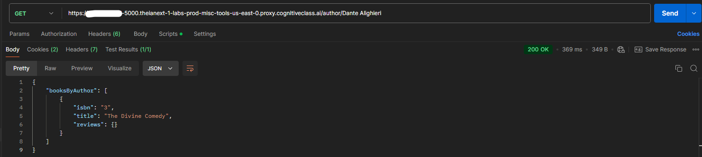

# Conference Event Planner

Course: [Developing Back-End Apps with Node.js and Express](https://www.coursera.org/learn/developing-backend-apps-with-nodejs-and-express?specialization=ibm-full-stack-cloud-developer) - [IBM Full Stack Software Developer](https://www.coursera.org/professional-certificates/ibm-full-stack-cloud-developer)

## Table of contents

- [Overview](#overview)
- [Project Features](#project-features)
- [Getting Started](#getting-started)


## Overview
In this project, a server-side book review application using Node.js and Express was build. The application provides a secure REST API with JWT-based authentication and allow users to perform various operations such as retrieving book information, posting reviews, and more.

## Project Features
- **Book Management:**
  - Retrieve a list of all books available in the bookshop.
  - Search books based on ISBN, author names, or titles.
  - Retrieve reviews and comments for specific books.
- **User Authentication:**
  - Register new users.
  - User login using JWT for session-level security.
- ** Review Management (for authenticated users):**
  - Add new book reviews.
  - Modify existing reviews (users can only edit their own).
  - Delete reviews (users can only delete their own).
- **Simultaneous User Access:**
  - Multiple users can access the application simultaneously to view and manage reviews.

## Getting Started
- Clone the repository (it was necessary to clone the repository of this course to start this project):

``` bash 
git clone git clone https://github.com/ibm-developer-skills-network/e-plantShopping.git](https://github.com/ibm-developer-skills-network/expressBookReviews.git
cd expressBookReviews/final_project/
```

- Install dependencies:

``` bash
npm install
```

- Start the development server:

``` bash
npm start
```

- Tested using Postman
  
Get all books

Get details by ISBN

Get book by author

Get book by title

Get book review

Register Customer

Login Customer

Add/Update Review

Delete review


## Acknowledgements
This project was developed as part of the IBM Full Stack Software Developer Specialization on Coursera. It provided valuable insights into creating back-end applications using Node.js and Express.

## License
This project is open-source and available under the Apache 2.0 License.
